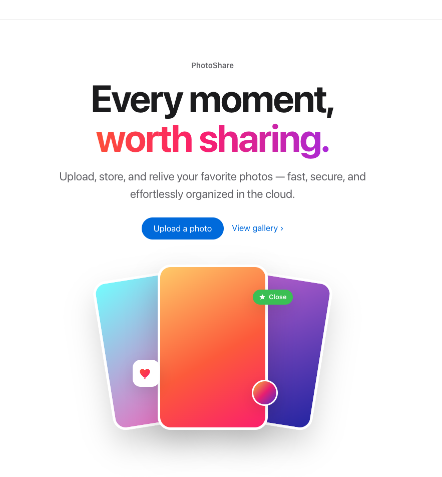
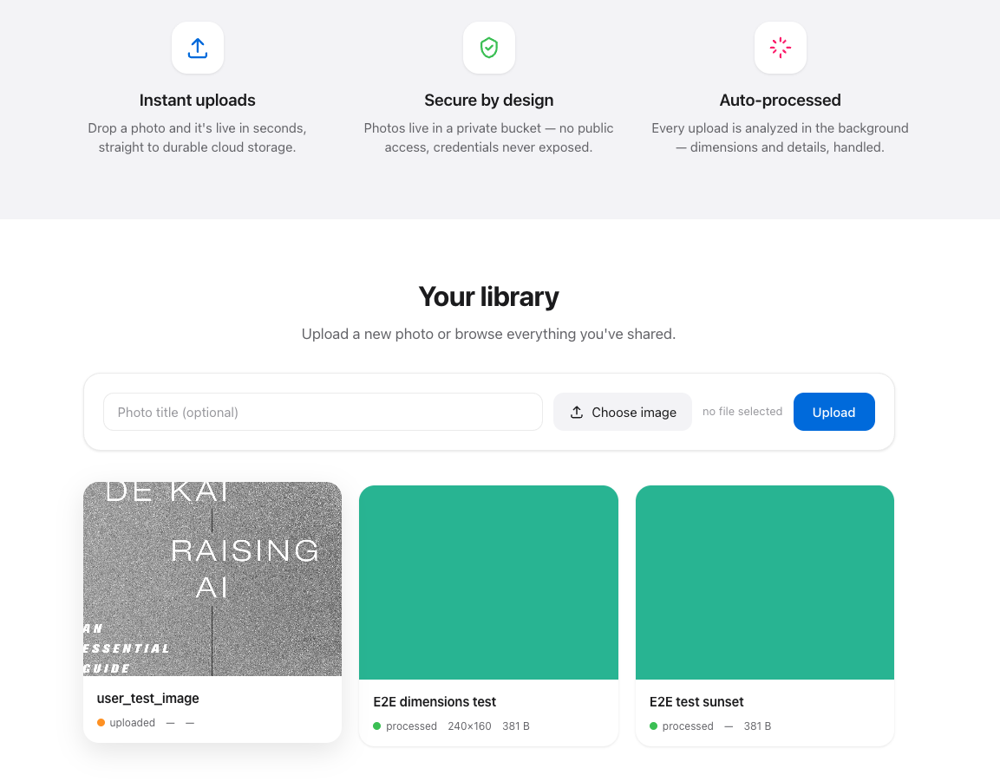

# PhotoShare — Architecture Walkthrough

> Companion to the build doc [[projects/photoshare-app|photoshare-app]] and the
> IaC in [`iac/`](./iac/README.md). One of 6 walkthroughs for **KR4**: explain
> design choices, tradeoffs, assumptions, and failure modes.
>
> **Status: Phase 2 deployed via CloudFormation and validated end-to-end on real
> AWS (2026-07-05).** Assumptions confirmed; failure modes verified against the
> live multi-AZ stack. See §7 for the deployment + test record.

## 1. Summary

PhotoShare is an Instagram-style photo-sharing web app. The core design idea is
**separation by trust boundary**: public-facing compute (ALB + web server) is
isolated from private data (RDS in a no-internet subnet), all static credentials
are removed (IAM roles + Secrets Manager + KMS), and image processing is
offloaded to an event-driven Lambda so it scales without managing servers.

The app itself is **self-built** — a FastAPI service with an Apple-inspired
frontend (see [`app/`](./app/README.md)), replacing the original tutorial's
prebuilt image so we own the full runtime contract. It was rebuilt from the
console version as **CloudFormation** (Phase 1 faithful → Phase 2 hardened +
multi-AZ), and the whole stack was **deployed and tested end-to-end on real AWS**.



## 2. Design choices (why each service)

| Component | Choice | Why |
| --- | --- | --- |
| Network | VPC, public + private subnets across 2 AZs | Trust boundary: reachable front door vs. isolated vault |
| Entry point | Application Load Balancer | Decouples users from server IPs; single hardened entry (see load-balancers note) |
| Web tier | EC2 (Docker) running our **own FastAPI image** (in ECR) | App compute core; self-built image (see [`app/`](./app/README.md)) for full control over the contract |
| Data | RDS MySQL, private, no public access | Managed relational store; 3-layer isolation (route, public-access switch, SG-referencing-SG) |
| Secrets | Secrets Manager + KMS | DB password fetched at runtime; never in source |
| Identity | IAM roles (EC2 + Lambda) | Temporary credentials, least privilege — no static keys anywhere |
| Images | S3, Block All Public Access | Durable object storage; served via app, never directly |
| Processing | Lambda on S3 event, no VPC attach; extracts image metadata (dimensions/size/format, stdlib-only) and calls back via ALB | Serverless burst scaling; stays out of the DB path (least privilege by architecture). Code is *inferred* (see [`lambda/`](./lambda/README.md)), not the original workshop's |
| Observability | CloudWatch dashboard + alarms | EC2 CPU + Lambda errors |

Fuller rationale for each lives in [[projects/photoshare-app|the build doc]]
(VPC front-door/vault, the KMS via-service nuance, the Lambda no-VPC decision).

## 3. Assumptions  *(confirmed 2026-06-17)*

Requirements agreed during discovery (via the
[[learning-plan/10-architecting/requirements-gathering-checklist|requirements checklist]]).
These drive the design:

| Requirement | Decision | Why it matters |
| --- | --- | --- |
| **Scale & region** | Single region (us-east-1); low/moderate traffic (~10k users) | DR = AZ resilience, not cross-region; no global replication |
| **RPO** | **Near-zero** — losing photos/metadata is unacceptable | → **RDS Multi-AZ** (synchronous standby) + S3 durability |
| **RTO** | ~15–30 min acceptable | Multi-AZ auto-failover is enough; no hot multi-region standby |
| **Availability** | Single-AZ OK for v1 (Phase 1); **multi-AZ target** (Phase 2); ~99.9% | The Phase 1 → Phase 2 story |
| **Budget** | Cost-sensitive (t3.micro, single small RDS, pay-per-use) | Right-size over raw performance; Multi-AZ ~2× DB cost (accepted) |
| **Compliance** | None (personal photos, no regulated data) | No HIPAA/GDPR/residency constraints |
| **Traffic pattern** | Spiky uploads, steadier reads | Serverless image processing; ASG scaling on web tier |

### Explicitly out of scope for v1

- **User authentication.** No login in v1 — deferred. When added, the intended
  design is **Amazon Cognito (OAuth2/OIDC)** with the app/ALB validating JWTs
  (see [[learning-plan/06-security-iam/oauth2-oidc-authentication-authorization|the OAuth/OIDC note]]).
  Documented as a known limitation, not an oversight.

## 4. Tradeoffs (what was chosen NOT to do, and why)

- **EC2 in a public subnet** (Phase 1) — simpler, but the ALB is the only thing
  that *needs* internet-facing placement. Phase 2 moves EC2 private + Session
  Manager for admin. *Tradeoff: convenience now vs. reduced attack surface.*
- **`db-sg` sourced from the whole VPC CIDR** (Phase 1) — avoids a create-order
  dependency, but broader than "only EC2." Phase 2 tightens to the web SG.
- **Lambda not VPC-attached** — gets free internet access and stays out of the DB
  path, at the cost of not being able to reach RDS directly (by design; it calls
  back through the ALB). *Tradeoff avoided: NAT/VPC-endpoint complexity.*
- **`POST /internal/metadata` reachable via the public ALB** — because the Lambda
  (outside the VPC) calls back through the ALB's public DNS, the "internal" route
  is technically internet-facing, guarded only by a shared `INTERNAL_API_KEY`
  header. *Acceptable for v1; hardening options:* a separate internal listener/ALB,
  a VPC endpoint + VPC-attached Lambda, or moving the callback onto SQS instead of
  HTTP. Flagged as a known limitation.
- **AWS-managed KMS key** — zero key management, but less control than a customer
  managed key (no custom rotation/policy). Fine for this workload.
- **CloudFormation over CDK** — more verbose, but maximizes learning of the raw
  resource model.
- **Single NAT Gateway** (Phase 2, introduced when the web tier moved private) —
  one NAT instead of one-per-AZ to control cost. *Tradeoff:* a single-AZ NAT is
  itself an AZ-failure risk for the private tier's *outbound* egress; acceptable
  at ~99.9% since it doesn't affect inbound user traffic or the RDS failover path.
  A per-AZ NAT would remove this at ~2× NAT cost.

## 5. Failure modes  *(mitigations deployed in Phase 2)*

For each component: what happens if it fails, blast radius, and the mitigation.
Phase 2 (the deployed stack) closes the Phase 1 single points of failure.

| Component | If it fails… | Blast radius | Mitigation (deployed) |
| --- | --- | --- | --- |
| Web EC2 (one instance) | that node gone | Contained | **ASG across 2 AZs** replaces it; ALB routes around it |
| RDS primary | brief failover | Seconds–minutes, no data loss | **Multi-AZ synchronous standby** (verified live) |
| ALB | entry point gone | Total | AWS-managed, **multi-AZ by default** |
| Single AZ outage | half of capacity | Survivable | multi-AZ ASG + RDS standby in the other AZ |
| Lambda | image processing stops | **Degraded, not down** (raw image still served) | Retries + **DLQ** (`photoshare-image-dlq`, verified empty) |
| NAT Gateway (single) | private tier loses *outbound* internet | Egress-only (no user-facing impact); inbound + RDS unaffected | Accepted at 99.9%; per-AZ NAT would remove it |
| S3 | images unavailable | High (core feature) | 11-nines durability; regional service |
| Secrets Manager unreachable | EC2 can't fetch DB password | App can't connect | Regional HA; app retries with backoff on startup |
| KMS unreachable | can't decrypt secret | App can't connect | Regional HA service; rare |

> **Observed in testing:** the ASG's self-healing was demonstrated for real —
> while debugging the startup bug (§7), unhealthy instances were continuously
> replaced by the ASG, and once the fixed image was rolled in, targets went
> healthy automatically with no manual intervention.

## 6. Well-Architected mapping (feeds KR3)

| Pillar | State (Phase 2, deployed) | Notes / further improvements |
| --- | --- | --- |
| Operational Excellence | Console → **IaC (CloudFormation)**, repeatable + versioned; app built via **CodeBuild → ECR** | Add change-set previews and a pipeline for automated rollouts |
| Security | Private DB (3-layer isolation), **db-sg scoped to web SG**, **EC2 in private subnets** (Session Manager admin), no static creds, S3 locked | Internal callback still ALB-public (see §4); scope the S3 policy tighter than `AmazonS3FullAccess` |
| Reliability | **ASG across 2 AZs + RDS Multi-AZ**, DLQ, health checks — verified live | Consider per-AZ NAT; automated failover testing |
| Performance Efficiency | Serverless image processing; ASG target-tracking on CPU | Load-test to tune thresholds/instance size |
| Cost Optimization | t3.micro, pay-per-use Lambda/S3, single NAT to save cost | Right-size after load testing; NAT is the main fixed cost |
| Sustainability | Managed services, scale-to-zero Lambda | — |

## 7. Deployment & validation record (2026-07-05)

### How it was built and deployed

- **App image built without local Docker.** Docker wasn't available locally, so
  the image was built in the cloud via **AWS CodeBuild** (source zipped to S3,
  `privilegedMode` build) and pushed to **ECR** — a clean demonstration of
  building containers without a local daemon.
- **Deployed with CloudFormation** (`photoshare-phase2.yaml`), image referenced
  by the `AppImageUri` parameter, `--capabilities CAPABILITY_NAMED_IAM`.
- **Pre-deploy validation caught real issues** (before spending a cent):
  `aws cloudformation validate-template` found a **circular dependency**
  (bucket → Lambda → role → bucket), fixed by constructing the bucket ARN as a
  string instead of `!GetAtt`. `cfn-lint` flagged a missing RDS
  `UpdateReplacePolicy`, also fixed.

### Live end-to-end test — passed

| Check | Result |
| --- | --- |
| CloudFormation deploy (40 resources, Multi-AZ) | `CREATE_COMPLETE` |
| ALB → ASG (2 AZs) → EC2 running our image | healthy targets |
| App fetches DB creds from Secrets Manager | working |
| Upload → S3 object + RDS row | working |
| S3 event → Lambda → ALB callback → RDS update | `status: processed` |
| Lambda dimension extraction (fuller `handler.py`) | `240×160, png` |
| Image streamed back through the app | HTTP 200 |
| RDS `PubliclyAccessible=false`, `MultiAZ=true` | confirmed on the live resource |
| DLQ depth | 0 (no failed invocations) |
| Frontend (Apple UI) served via ALB | serving |



### The one real bug (worth remembering)

The app crash-looped on first deploy: PyMySQL couldn't authenticate to **MySQL 8**
because MySQL 8 defaults to the **`caching_sha2_password`** auth plugin, which
PyMySQL needs the **`cryptography`** package to handle — and it wasn't in
`requirements.txt`. Symptom: `'cryptography' package is required for
sha256_password or caching_sha2_password auth methods`, app startup fails, ASG
recycles the instance. **Fix:** add `cryptography` to `requirements.txt`, rebuild,
roll the ASG (instance refresh). This is exactly the class of bug a local Docker
smoke-test would have caught instantly — a concrete argument for that test tier.

### Notable observations

- **ASG self-healing worked for real** — unhealthy instances were replaced
  automatically; rolling the fixed image via **instance refresh** brought targets
  healthy with no manual steps.
- **RDS Multi-AZ conversion is the slow step** (~10–15 min): RDS creates single-AZ,
  then converts (`modifying` → standby sync → `configuring-enhanced-monitoring` →
  `backing-up` → `available`).
- **The trimmed inline Lambda vs. the fuller `handler.py`**: the template ships a
  minimal inline function (size only, due to the 4096-char inline cap); the full
  dimension-parsing handler was deployed separately via `update-function-code`.

## Screenshots

Images live in [`screenshots/`](./screenshots/) (see its README for the naming
convention). To embed one, use a relative path, e.g.:

```markdown

```

Planned shots (check off as added):

- [x] `01-frontend-hero.png` — landing page (hero + CTA) — embedded in §1
- [x] `02-gallery.png` — gallery with uploaded photos — embedded in §7
- [ ] `04-cfn-stack-complete.png` — CloudFormation `CREATE_COMPLETE`
- [ ] `05-alb-targets-healthy.png` — ALB targets healthy across 2 AZs
- [ ] `06-rds-multiaz.png` — RDS Multi-AZ + not publicly accessible
- [ ] `07-s3-block-public-access.png` — S3 bucket public access blocked
- [ ] `08-cloudwatch.png` — CloudWatch dashboard / alarms

<!-- Once files are added, drop the embeds inline in the relevant sections, e.g.:


-->
